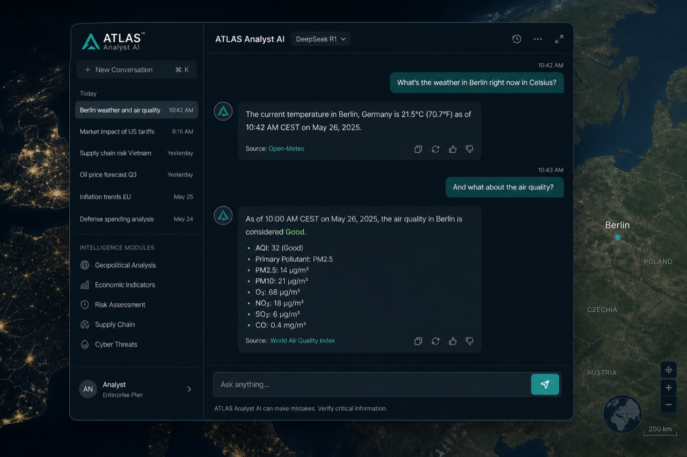
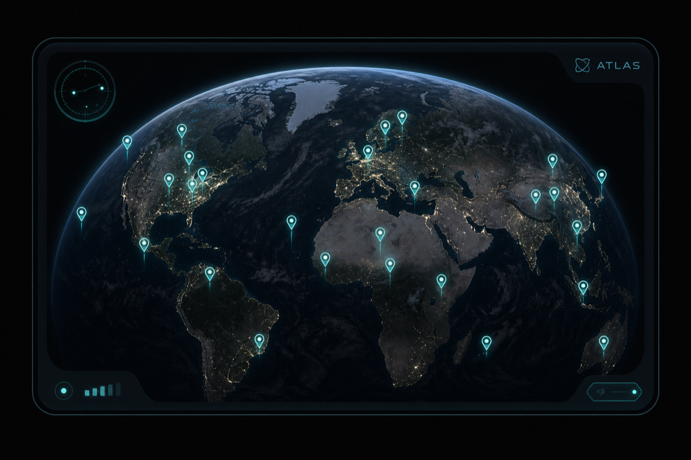

<!-- aicom-mirror-notice -->
> **📖 Read-only mirror.** `atlas` is published from the canonical AI-Factory monorepo.
> **Pull requests are not accepted** — any commit pushed here is overwritten by
> `scripts/mirror_satellites.sh` on the next sync.
> 🐞 Found a bug or have a request? Please **[open an issue](https://github.com/alexar76/atlas/issues)**.

# ATLAS

<!-- aicom-readme-badges -->
<p align="center">
  <a href="https://github.com/alexar76/atlas/actions/workflows/ci.yml"></a>
  <a href="https://github.com/alexar76/atlas/actions/workflows/pages.yml"></a>
  <a href="https://alexar76.github.io/atlas/"></a>
  <a href="https://iot.modelmarket.dev/"></a>
  
  =3.11" />
  
  
  
  
  <a href="LICENSE"></a>
</p>
<!-- /aicom-readme-badges -->

<p align="center">
  <strong>ATLAS</strong> — planetary physical-sensor map over <a href="https://iot.modelmarket.dev/">GAIA</a> live relays<br/>
  Part of the <a href="https://github.com/alexar76">alexar76</a> AI agent economy
</p>

<p align="center">
  <a href="https://alexar76.github.io/atlas/">
    
  </a>
  <br>
  <sub>Weather · air · tide · grid · quake — <a href="https://alexar76.github.io/atlas/"><b>landing →</b></a> · <a href="#quick-start"><b>run locally →</b></a></sub>
</p>

<p align="center">
  <strong><a href="https://alexar76.github.io/atlas/">Landing</a></strong>
  ·
  <strong><a href="docs/GUIDE.md">Guide (EN)</a></strong>
  ·
  <strong><a href="https://iot.modelmarket.dev/">GAIA</a></strong>
  ·
  <strong><a href="https://magic-ai-factory.com/monitor/">Alien Monitor</a></strong>
</p>

**Docs:** [EN](docs/GUIDE.md) · [RU](docs/i18n/GUIDE.ru.md) · [ES](docs/i18n/GUIDE.es.md) · [FR](docs/i18n/GUIDE.fr.md) · [ZH](docs/i18n/GUIDE.zh.md)

ATLAS is the ecosystem **physical sensor map**: live weather, air quality, tides, UK grid carbon, and earthquakes plotted from GAIA relays. It ships as the **`atlas`** node on Alien Monitor (`/embed` + full-map CTA) and includes **ATLAS Analyst** (DeepSeek `deepseek-v4-pro` by default) grounded on a server-injected LIVE snapshot.

## Gallery

<p align="center">
  <br>
  <sub>Full map · layers · in-view list</sub>
</p>

<p align="center">
  
  &nbsp;
  <br>
  <sub>ATLAS Analyst (DeepSeek) · Alien Monitor embed</sub>
</p>

## Surfaces

| Surface | Path |
|---------|------|
| Full map + AI | `/` |
| Alien Monitor embed | `/embed` |
| Health | `/health` |
| Snapshot / viewport / station | `/api/v1/*` |
| Analyst chat | `/api/ai/ask` |

## Quick start

```bash
docker compose -f docker-compose.local.yml up -d --build
open http://127.0.0.1:9330/
```

Without Docker:

```bash
cd backend
python -m venv .venv && source .venv/bin/activate
pip install -r requirements.txt
ATLAS_PUBLIC_URL=http://127.0.0.1:9330 uvicorn app.main:app --reload --port 9330
```

Point `GAIA_URL` / `ATLAS_GAIA_URL` at a live GAIA (default `https://iot.modelmarket.dev`). Set `DEEPSEEK_API_KEY` for Analyst.

## Production

```bash
export DEEPSEEK_API_KEY=sk-...
docker compose -f docker-compose.yml up -d --build
# nginx: deploy/nginx/atlas.modelmarket.dev.conf (host)
```

## Load model

| Mechanism | Role |
|-----------|------|
| Cheap fleet poll | Pins only |
| Viewport readings | Sensors **in the visible bbox** |
| Click detail | Human-readable card + shared TTL cache |
| Single-flight | One GAIA call per sensor under concurrency |
| SSE | Fleet snapshot fan-out |
| Analyst | Server-side LIVE snapshot in the prompt |

Buyers **cannot** pass lat/lon into GAIA invoke — anchors are operator env on GAIA.

## Tests

```bash
pip install -r backend/requirements.txt -r backend/requirements-dev.txt
pytest -q
```

Mocked GAIA — no network required. **39** tests.

## Alien Monitor

Node id `atlas` · env `ALIEN_ATLAS_URL` / `ALIEN_PUBLIC_ATLAS_URL` · panel: sensors + `/embed` + full map CTA.

## License / attribution

MIT — see [LICENSE](LICENSE).

Map UI over GAIA relays. Open-Meteo CC BY 4.0; NWS/USGS/NOAA U.S. public domain; UK Carbon Intensity open data.
