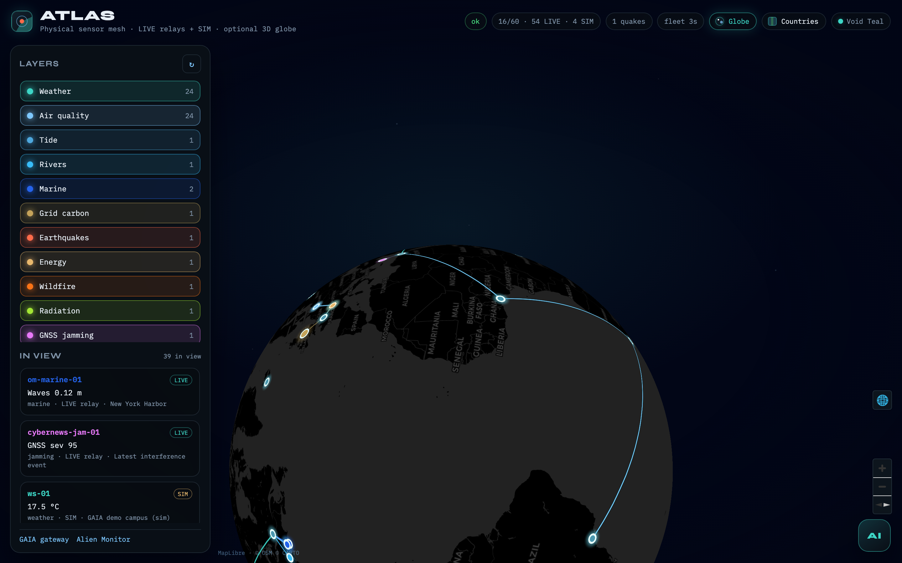

# ATLAS

> 🌐 [English](../README.md) · [Русский](README.ru.md) · **Español** · [Français](README.fr.md) · [中文](README.zh.md) · [Glosario](https://github.com/alexar76/aicom/blob/main/docs/localization-glossary.md)


<p align="center">
  <strong>ATLAS</strong> — <strong>mapa de sensores</strong> planetario sobre relés de <a href="https://iot.modelmarket.dev/">GAIA</a><br/>
  Pins honestos <strong>LIVE</strong> vs <strong>SIM</strong> · <strong>globo 3D</strong> opcional · parte de la economía de agentes <a href="https://github.com/alexar76">alexar76</a>
</p>

<p align="center">
  <strong><a href="https://atlas.modelmarket.dev/">Mapa en vivo</a></strong>
  ·
  <strong><a href="https://alexar76.github.io/atlas/">Landing</a></strong>
  ·
  <strong><a href="https://iot.modelmarket.dev/">GAIA</a></strong>
  ·
  <strong><a href="https://magic-ai-factory.com/monitor/">Alien Monitor</a></strong>
</p>

**Docs:** [EN](GUIDE.md) · [RU](i18n/GUIDE.ru.md) · [ES](i18n/GUIDE.es.md) · [FR](i18n/GUIDE.fr.md) · [ZH](i18n/GUIDE.zh.md)  
**Añadir un sensor:** [add-gaia-atlas-sensor](https://github.com/alexar76/aicom/blob/main/docs/add-gaia-atlas-sensor.md)

ATLAS es el **mapa de sensores físicos** del ecosistema: clima, calidad del aire, mareas, ríos, marino, carbono de la red UK, terremotos, **incendios**, **radiación**, estaciones de **integridad GNSS**, informes de **jamming GNSS** con fuente separada, **AIS finlandés público**, **NWS tsunami CAP**, **ADS-B/AIS** de borde opcional y energía — desde relés de [GAIA](https://iot.modelmarket.dev/). Cada estación GNSS es un `point_id` estable; los agentes consultan vía `atlas.point.read@v1` o un campo firmado point/bbox/route vía `atlas.gnss.degradation.read@v1`. **Los dispositivos open-data nuevos se registran en GAIA; capas, pins y watchboxes son ATLAS**. Los pins son **LIVE** solo si GAIA expone un URL de provenance `source`; los simuladores son **SIM**. Incluye **ATLAS Analyst** (DeepSeek `deepseek-v4-pro` por defecto) con firewall anti prompt-injection y un **brief del ecosistema** AICOM / AIMarket completo.

## Galería

<p align="center"></p>

## Superficies

| Superficie | URL / path |
|---------|------------|
| **Mapa público** | https://atlas.modelmarket.dev/ |
| Landing | https://alexar76.github.io/atlas/ |
| Embed Alien Monitor | `/embed` |
| Health | `/health` |
| Snapshot / viewport / station / watchboxes | `/api/v1/*` |
| Analyst chat | `/api/ai/ask` |

## Inicio rápido

```bash
pip install aimarket-atlas
export ATLAS_GAIA_URL=https://iot.modelmarket.dev
atlas --host 127.0.0.1 --port 9330
```

Docker: `docker compose -f docker-compose.local.yml up -d --build`

## Production

```bash
./scripts/deploy_atlas.sh --remote root@<host>
```

## Modelo de carga

| Mecanismo | Rol |
|-----------|------|
| Cheap fleet poll | Solo pins |
| Lecturas del viewport | Sensores **en el bbox visible** |
| LIVE vs SIM | `source` presente ⇒ LIVE; si no SIM |
| Analyst | Snapshot + firewall + reintentos; idioma = pregunta ∥ UI locale |

Los compradores **no** pueden pasar lat/lon al invoke de GAIA.

## Pruebas

```bash
pip install -e ".[dev]" && pytest -q
```

**101** tests · GAIA mockeada.

## Licencia

MIT — [LICENSE](../LICENSE). Atribuciones open-data: Open-Meteo CC BY 4.0; NWS/USGS/NOAA dominio público EE.UU.; FIRMS cite NASA; Safecast CC0.
